University: ITMO University
Faculty: FICT
Course: Введение в веб технологии
Year: 2025/2026
Group: U4125
Author: Pomortseva Anastasia Pavlovna
Lab: Lab1
Date of create: 02.03.2026
Date of finished: 10.03.2026

Ход работы:

1. Docker --version

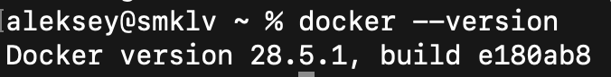

2. Запуск тестового контейнера

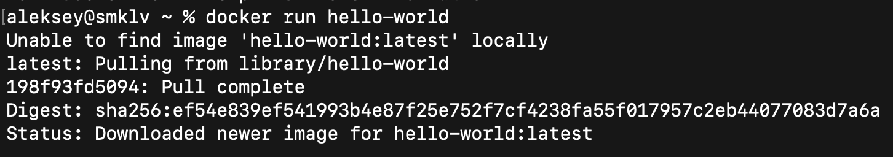

3. Запущенные контейнеры

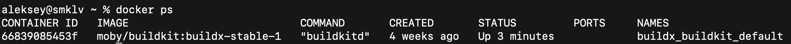

4. Все контейнеры

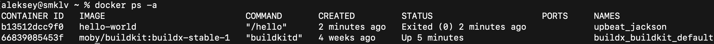

5. Локальные образы

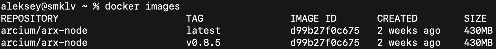

6. Установка образа Ubuntu

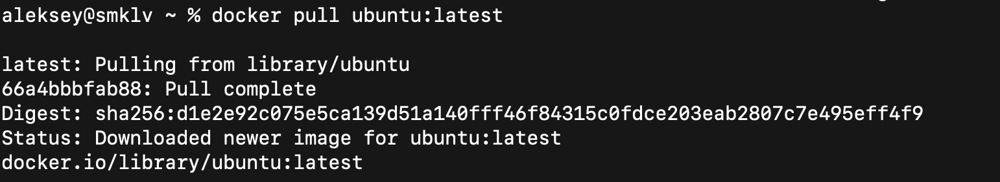

7. Запуск контейнера и установка пакета curl

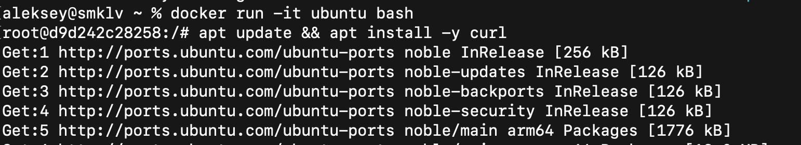

8. Проверка установки curl и выход из контейнера

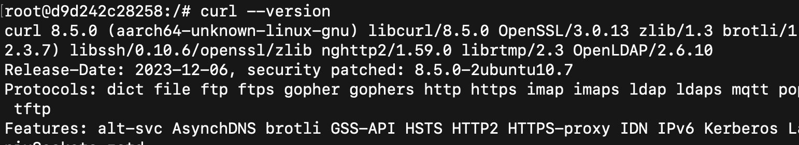

9. Запуск контейнера с nginx

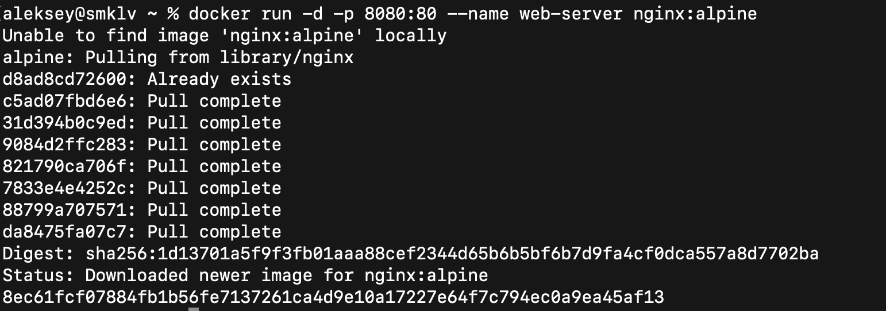

10. Проверка работы

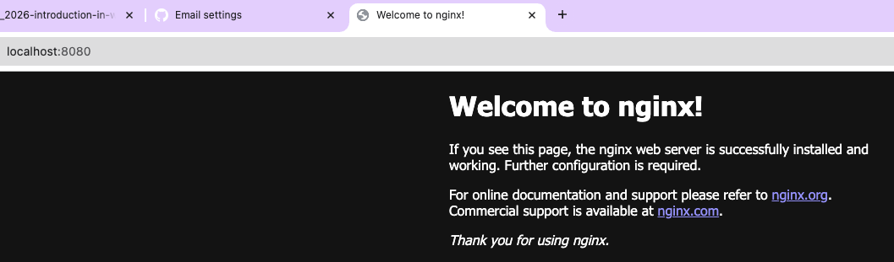

11. Просмотр логов контейнера

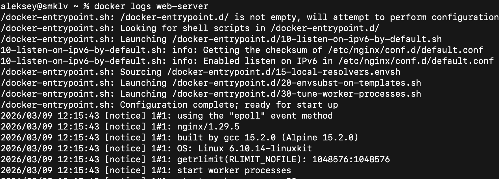

12. Подключение к контейнеру и выполнение команды ls -la

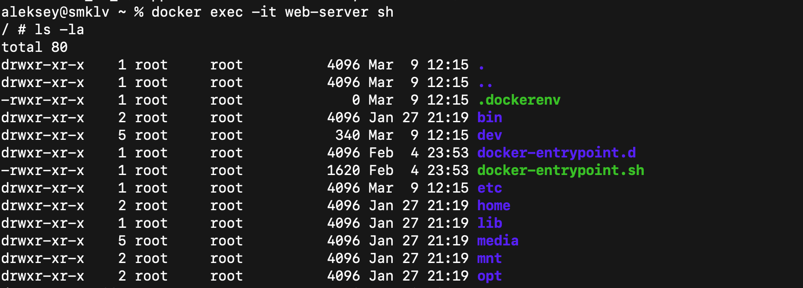

13. Список запущенных контейнеров

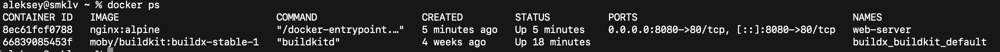

14. Список всех контейнеров

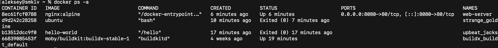

15. Остановка, запуск и удаление контейнера web-server

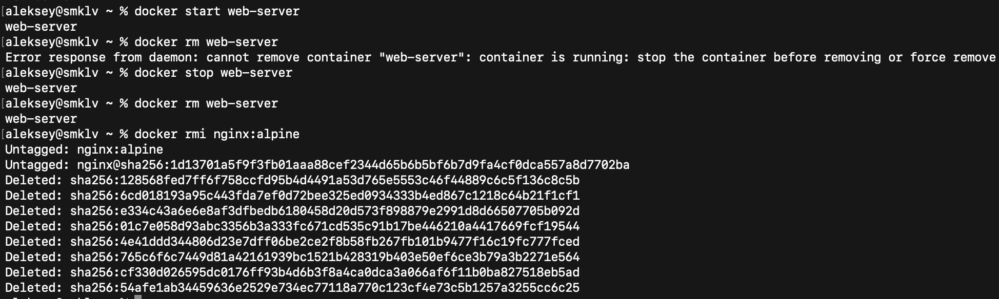

16. Создание, запуск контейнера с томом, подключение и создание файла

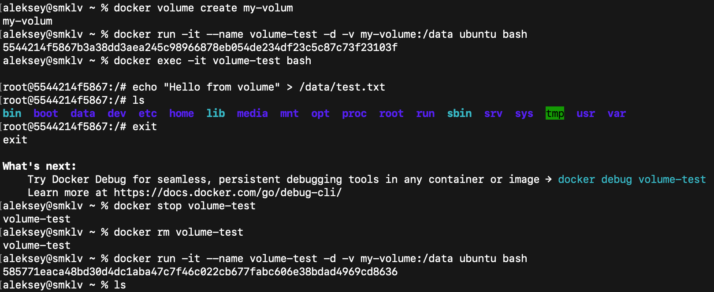

17. Удаление контейнера, создание нового с тем же томом и проверка содержимого файла

