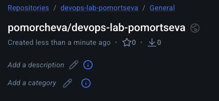
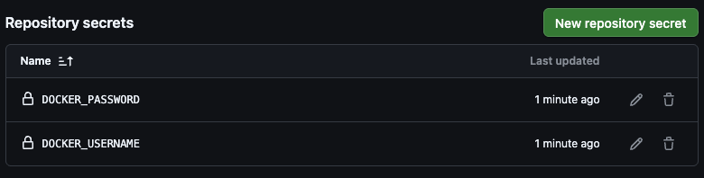
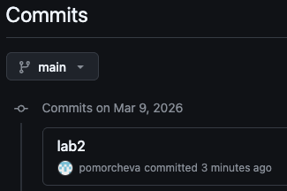
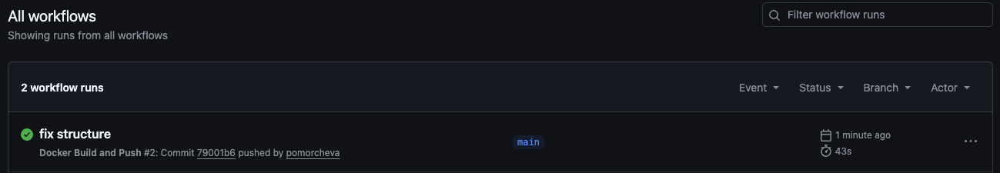
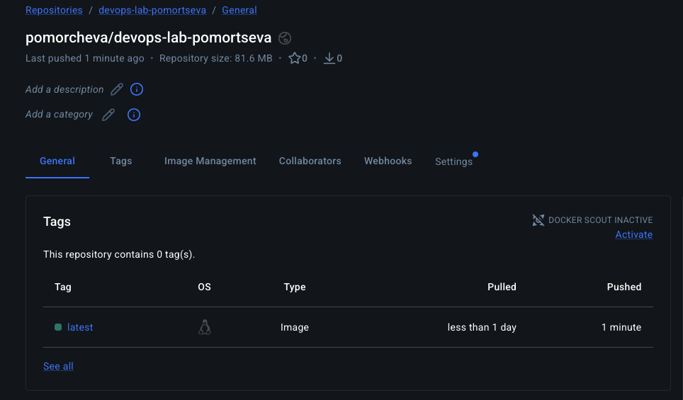
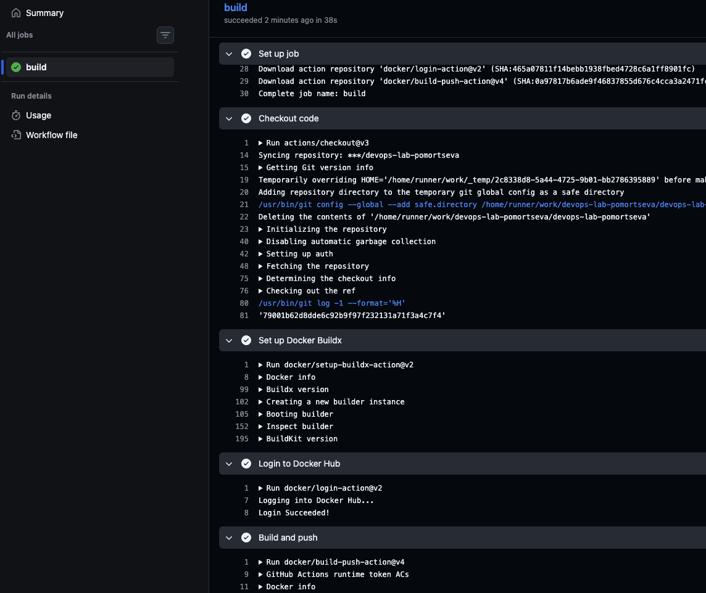

University: ITMO University
Faculty: FICT
Course: Введение в веб технологии
Year: 2025/2026
Group: U4125
Author: Pomortseva Anastasia Pavlovna
Lab: Lab2
Date of create: 02.03.2026
Date of finished:

Ход работы:

1. Создание аккаунта Docker Hub и репозитория

2. Создание папки .github/workflows/ и файла docker-build.yml https://github.com/pomorcheva/devops-lab-pomortseva/

3. Создание секретов

4. commit & push в main ветку

5. Выполнение пайплайна

6. Добавление образа на Docker Hub

7. Логи в Actions

