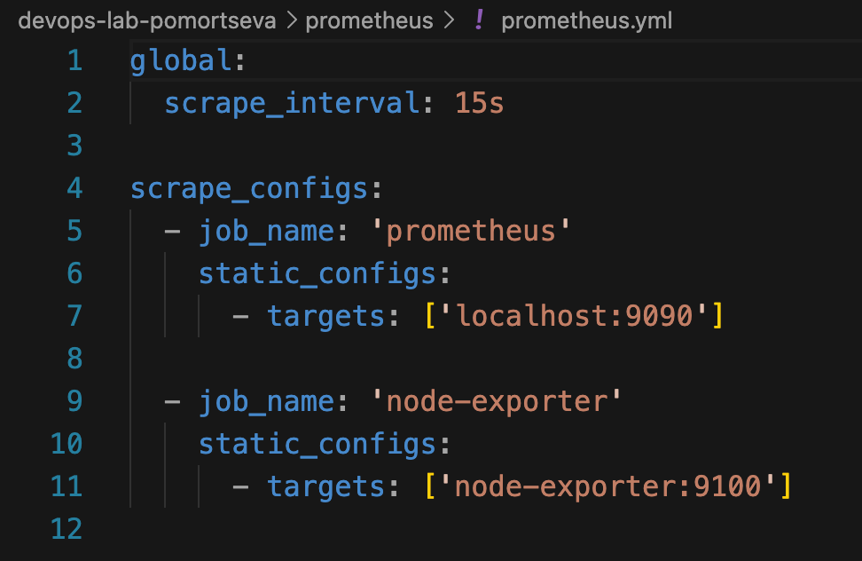
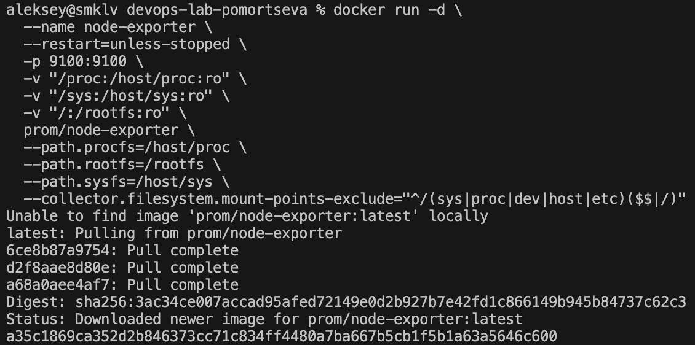
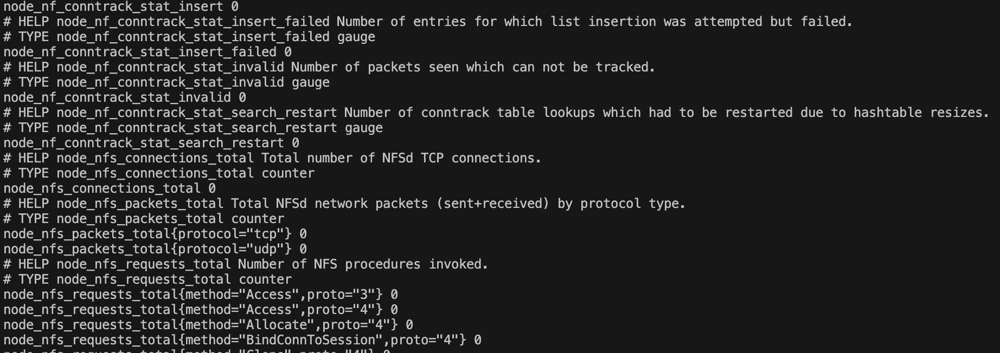
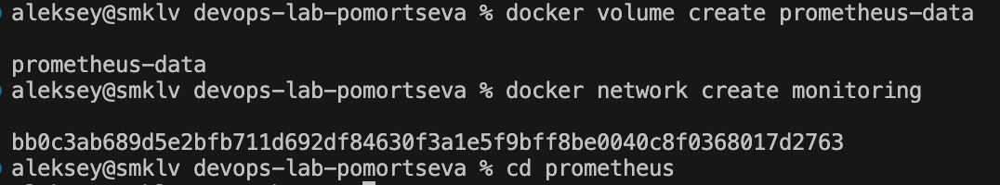
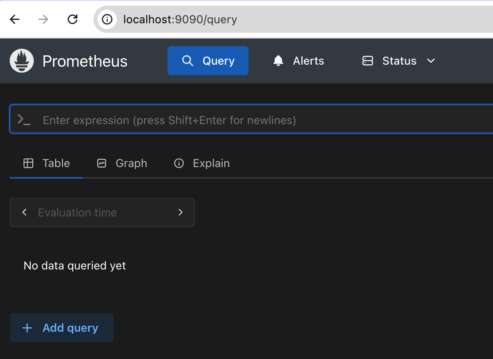
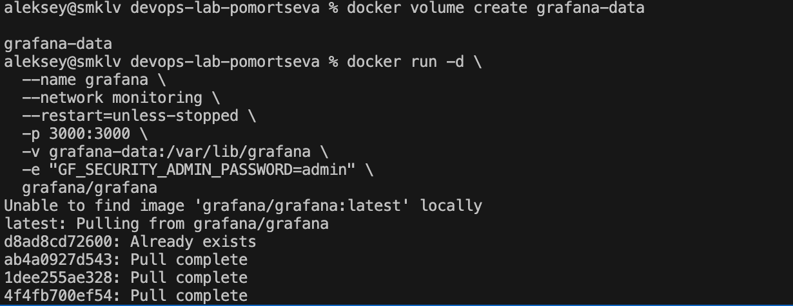
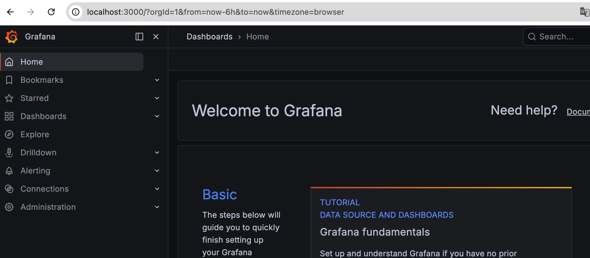
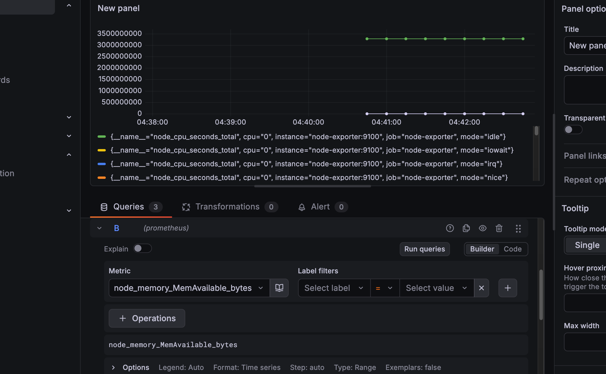
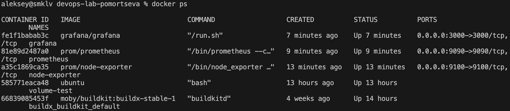

University: ITMO University
Faculty: FICT
Course: Введение в веб технологии
Year: 2025/2026
Group: U4125
Author: Pomortseva Anastasia Pavlovna
Lab: Lab3
Date of create: 02.03.2026
Date of finished: 10.03.2026

Ход работы:

1. Создание директории и создание файла prometheus/prometheus.yml

2. Запуск Node Exporter

3. Проверка curl запросом curl http://localhost:9100/metrics

4. Создание и установка prometheus

5. Проверка работы prometheus http://localhost:9090

6. Создание и установка grafana

7. Проверка работы grafana

8. Добавление prometheus в grafana

9. Создание dashboard и добавление метрик

10. Финальная проверка

